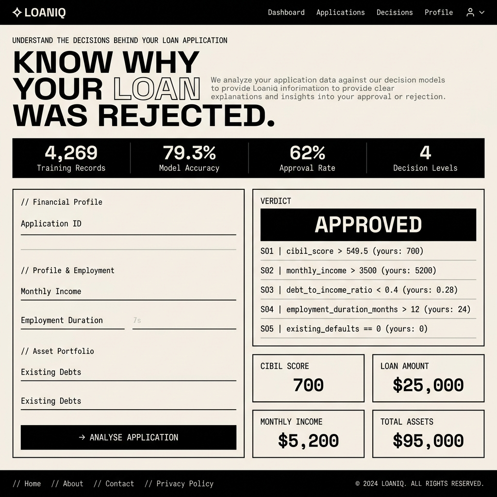

# LoanIQ — Explainable Loan Rejection Simulator

LoanIQ is a lightweight, interactive web application that simulates a bank's loan approval process. While typical machine learning pipelines act as black boxes, LoanIQ prioritizes transparency. It uses a decision tree classifier with a constrained depth to guarantee that every decision can be mapped back to a human-readable rule path (IF-THEN trace).

The app is built entirely in Python using Streamlit and scikit-learn, styled with a strict Neo-Brutalist (Swiss-grid) visual theme.



## 🚀 Live URL & Repository

- **Live Application:** [https://modernloanprediction.streamlit.app](https://modernloanprediction.streamlit.app)
- **GitHub Repository:** [https://github.com/Raj1952/Modern-Loan-Prediction](https://github.com/Raj1952/Modern-Loan-Prediction)

---

## Technical Architecture & Core Decisions

### Single-File Streamlit Architecture (`streamlit_app.py`)
To enable frictionless deployment to Streamlit Community Cloud and avoid managing separate client-server runtimes, the entire backend (model training, caching, prediction logic) and frontend (HTML/CSS overrides, rendering) are consolidated into a single file: `streamlit_app.py`.

### Explainability over Complexity
Modern ML pipelines often reach for high-accuracy black-box estimators (e.g., XGBoost, Random Forests). However, in financial lending compliance, proving *why* a customer was rejected is often a legal requirement. 
- **Model:** `DecisionTreeClassifier(max_depth=4, random_state=42)`
- **Constraint:** Clamping the maximum depth to `4` keeps the decision tree to a maximum of 4 logical splits. This balances model performance (~79-80% training accuracy) with complete model interpretability.
- **Trace Extraction:** When a user inputs their application data, the model traverses the trained estimator's estimator paths, extracting the decision node thresholds, the feature evaluated, and the user's actual value, compiling a step-by-step audit log of the prediction.

---

## Tech Stack & Dependencies

- **Framework:** Streamlit (UI rendering & state management)
- **ML Engine:** scikit-learn (DecisionTreeClassifier, LabelEncoder)
- **Data Engineering:** pandas, numpy
- **Visualizations:** matplotlib (Feature importances, dataset distributions)
- **Design System:** Space Grotesk (sans-serif body), Space Mono (monospace numbers/labels)

---

## Data Pipeline & Preprocessing

The model is trained on a dataset of **4,269 loan applications** (approx. 62% approved, 38% rejected).

### Features Evaluated:
- **Numerical:** `cibil_score` (credit score), `income_annum`, `loan_amount`, `loan_term`, `no_of_dependents`
- **Asset Portfolios (Numerical):** Bank assets, residential assets, commercial assets, luxury assets
- **Categorical:** `education` (Graduate/Not Graduate), `self_employed` (Yes/No)

### Gotchas Solved in Data Loading:
1. **Leading Whitespace in CSV Columns:** The source CSV (`data/loan_approval_dataset.csv`) contains leading/trailing spaces in both column names (e.g., `" loan_status"`) and categorical values (e.g., `" Rejected"`). The data loader automatically strips whitespace from all columns and text fields upon reading.
2. **Dynamic Encoder Fitting:** Categorical columns are transformed using `LabelEncoder` instances fitted dynamically during data ingestion, ensuring consistency between model training and form input prediction.

---

## Caching Strategy

To avoid training the model from scratch on every user interaction (which degrades UI responsiveness), the training pipeline is cached using Streamlit's `@st.cache_resource` decorator:

```python
@st.cache_resource
def get_model_and_data():
    # 1. Load CSV data
    # 2. Clean column & string whitespaces
    # 3. Label encode categorical fields
    # 4. Train DecisionTreeClassifier(max_depth=4)
    # 5. Extract feature importances
    return model, df, feature_names, encoders
```

---

## Neo-Brutalist Design System

The application breaks away from standard "AI-dashboard" templates (glassmorphism, purple/neon gradients, rounded cards) in favor of a raw, Swiss-grid Neo-Brutalist aesthetic.

### Styling Tokens:
- **Ink:** `#0A0A0A` (Heavy borders, headers, buttons, active states)
- **Paper:** `#F5F0E8` (Warm, low-contrast cream background)
- **Surface:** `#FDFAF4` (Panel backgrounds)
- **Muted:** `#D0C8B8` (Dividers, structural guidelines)
- **Borders:** Hard, solid `1.5px` or `2px #0A0A0A` outline. No rounded corners (`border-radius: 0px`).
- **Typography:** Space Grotesk for core text; Space Mono for statistics, forms, labels, and decision logs.

### Overriding Streamlit's Native DOM Styles:
Streamlit does not provide native hooks for custom themes outside of standard primary/background variables. To achieve the Neo-Brutalist layout, we inject custom CSS targeting specific Streamlit data-attributes:

- **Input Overrides:** Target number inputs and slider widgets to ensure high readability with the cream theme:
  ```css
  div[data-testid="stNumberInput"] input {
      background-color: #FDFAF4 !important;
      color: #0A0A0A !important;
      border: 1px solid #0A0A0A !important;
      border-radius: 0px !important;
  }
  ```
- **Button Overrides:** Standardize the form submit button to match the brutalist aesthetic:
  ```css
  div[data-testid="stFormSubmitButton"] > button {
      background-color: #0A0A0A !important;
      color: #F5F0E8 !important;
      border-radius: 0px !important;
      border: 2px solid #0A0A0A !important;
  }
  ```
- **Custom HTML Renderer for Decision Tree:** Rather than using the default Graphviz tree (which conflicts with light themes) or raw text outputs, we parse the tree rules into a custom-styled HTML block matching the core theme palette.

---

## Running Locally

### 1. Clone the repository:
```bash
git clone https://github.com/Raj1952/Modern-Loan-Prediction.git
cd Modern-Loan-Prediction
```

### 2. Configure a virtual environment:
```bash
python -m venv venv
# On Windows:
venv\Scripts\activate
# On macOS/Linux:
source venv/bin/activate
```

### 3. Install dependencies:
```bash
pip install -r requirements.txt
```

### 4. Start the application:
```bash
streamlit run streamlit_app.py
```

---

## Production Deployment Notes

The app runs on **Streamlit Community Cloud** with continuous deployment synced to the `main` branch.

### Python 3.14 Compatibility:
Streamlit Cloud operates on a bleeding-edge Python 3.14 runtime. Many pinned libraries (such as older versions of `pillow` or compiled C-extensions) lack pre-built wheels for Python 3.14 and fail during build compilation on the cloud server.
To solve this:
- Pin requirements loosely (`streamlit>=1.40.0`, `scikit-learn>=1.5.2`) to allow pip to locate pre-built wheels.
- Added `packages.txt` containing debian system dependencies (`zlib1g-dev`, `libjpeg-dev`, `libpng-dev`) as a failover compiling layer.
